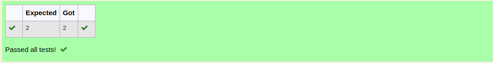

# RANK-OF-A-MATRIX
## Aim:
To write a python program to find the rank of a matrix
## Equipment’s required:
1. 	Hardware – PCs
2. 	Anaconda – Python 3.7 Installation / Moodle-Code Runner
## Algorithm:
### Step 1: 
Use import function to build numpy.

### Step 2: 
Assign the list of values using np.array.

### Step 3: 
Using the np.linalg.matrix_rank(), we can find the rank of the given matrix.

### Step 4: 
Print the result.

## Program:
```
rank of a matrix
developed by: dhivyapriya. r
register no.: 22008389
```
import numpy as np

a=np.array([[3,2,5],[1,1,2],[3,3,6]])

result=np.linalg.matrix_rank(a)

print(result)

## Output:


## Result:
Thus the rank for the given matrix is successfully solved by  using a python program.

